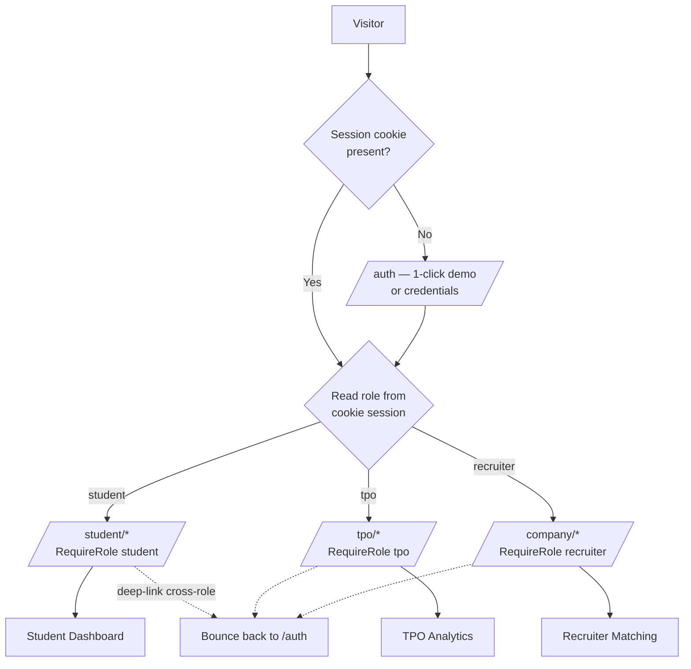
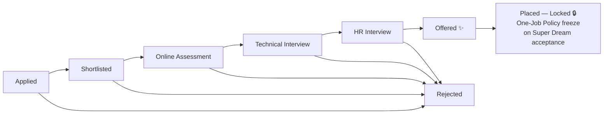

<div align="center">

# ⚡ Placement Portal

### *The Institutional Placement Cell, Reimagined*

**A production-grade, role-based College Placement Management System — engineered for speed, hardened with audit trails, and wrapped in a luxury-cyberpunk interface of deep obsidian, rich purple, and subtle gold.**

[](https://www.typescriptlang.org/)
[](https://react.dev/)
[](https://vite.dev/)
[](https://tailwindcss.com/)
[](https://convex.dev/)
[](docs/DEPLOYMENT.md)
[](#-testing)

</div>

---

## 📋 Table of Contents

- [Why Placement Portal?](#-why-placement-portal)
- [Role Architecture](#-role-architecture)
- [Screenshots](#-screenshots)
- [System Flowcharts](#-system-flowcharts)
- [Quickstart](#-quickstart)
- [Offline Demo (Docker)](#-offline-demo-docker)
- [Feature Comparison](#-feature-comparison)
- [Feature Matrix](#-feature-matrix)
- [Testing](#-testing)
- [Documentation](#-documentation)
- [Project Structure](#-project-structure)

---

## 🎯 Why Placement Portal?

Campus placement cells still run on WhatsApp groups, Excel sheets, and manual CGPA eyeballing. Every eligibility check is a human error waiting to happen; every status update is a rumor.

**Placement Portal replaces all of it with one unified platform where:**

- 🛡️ **Eligibility is computed, never hand-checked** — a pure, shared rules engine (CGPA cutoffs, backlog caps, branch filters, tiered One-Job Policy) gates every application at both the UI and the data layer.
- 🔒 **The browser is a rendering layer, never an authority** — every privileged action is re-verified server-side, and CGPA/backlog records are academically locked behind TPO verification.
- 📜 **Every critical action is logged** — verification toggles, CGPA overrides, bulk offer releases, and drive modifications land in a compliance-grade audit ledger with actor, timestamp, and field-level diffs, exportable for NAAC/NBA reviews.
- ⚡ **The UI is optimistic** — applications, stage progressions, and verification flips render in under 100 ms with server reconciliation underneath.
- 🖤 **It looks the part** — a deliberate luxury-cyberpunk identity: deep obsidian `#030307` canvas, frosted glass panels with purple-frost borders, and warm gold reserved for the metrics that matter.

---

## 👥 Role Architecture

Three strict personas, each with a cookie-enforced route domain and a dedicated workspace:

| Persona | Route Domain | Workspace Highlights |
|---|---|---|
| 🎓 **Student** | `/student/*` | Drive catalog with eligibility tooltips, 6-stage application pipeline stepper, offer negotiation with digital signatures, document vault, resume generator, live announcements |
| 🏛️ **TPO Admin** | `/tpo/*` | Placement analytics with SVG charts, drive creation with multi-round config, applicant tracking, interview scheduler, student verification, institutional PDF/Excel reports, security audit trail, broadcast composer |
| 🏢 **Recruiter** | `/company/*` | AI-powered candidate matching with compatibility scores, batch shortlisting, interview slot allocation with conflict prevention, Google Meet integration |

All routes are guarded twice: client-side role middleware for UX, server-side `requireStudent` / `requireTpo` checks as the final authority. Deep-linking across roles bounces to `/auth`.

---

## 📸 Screenshots

> *Replace the placeholders below with actual captures from your deployment.*

### Landing Page

*Obsidian hero with gradient CTAs leading into the auth sandbox.*

### Student Dashboard

*CGPA/backlog metrics, drive-eligible banner, active drives with 1-click apply, and the application pipeline.*

### TPO Analytics

*Placement rate, CTC distribution donut, branch-wise bar chart, and live drive progress.*

### Recruiter Scheduler

*Slot chunking from daily windows, conflict-free assignment, and Meet-link generation.*

<details>
<summary>📸 How to capture screenshots</summary>

1. Open the deployed preview and take full-page screenshots at 1440×900.
2. Save them as `landing.png`, `student-dashboard.png`, `tpo-analytics.png`, and `recruiter-scheduler.png` under `docs/screenshots/`.
3. The markdown above will render them automatically.

</details>

---

## 🔄 System Flowcharts

### Authentication & Role Routing



### Application State Machine



Every transition is validated server-side, triggers an automated notification to the student, and — for offer releases — is written to the audit ledger.

---

## 🚀 Quickstart

> **Package manager:** this repo uses **Bun**. With npm, swap `bun` for `npm` / `npx`.

```bash
# 1 — Clone and install
git clone https://github.com/your-org/placement-portal.git
cd placement-portal
bun install

# 2 — Start the dev stack (Vite + Convex backend, seed data included)
bun run dev

# 3 — Open the app and jump into any role
open http://localhost:5173
```

On first load, the **floating Demo Switcher** (bottom-left) hydrates the full dataset — 25+ students, 6 active drives, 30+ applications at every pipeline stage, interview slots, offers, threads, and broadcasts — so every chart and table is populated instantly. Click any role to sign in and be routed to its dashboard with zero manual login.

For a manual login flow, navigate to `/auth` and use the 1-click demo cards.

**Environment variables** are pre-wired for the sandbox Convex deployment (`VITE_CONVEX_URL`, auth keys). For production configuration, see [`docs/DEPLOYMENT.md`](docs/DEPLOYMENT.md).

---

## 🐳 Offline Demo (Docker)

Need to present with zero internet? The repo ships a full offline stack:

```bash
./run-demo.sh          # builds containers, starts Postgres + app, seeds, opens :3000
./run-demo.sh --reseed # wipe and repopulate with fresh demo data
./run-demo.sh --stop   # tear down
```

See [`docs/LOCAL_DEMO.md`](docs/LOCAL_DEMO.md) for the air-gapped transfer recipe (`docker save` / `docker load`).

---

## 📊 Feature Comparison

| Capability | Traditional Placement Cell | 📊 Spreadsheets + WhatsApp | ⚡ Placement Portal |
|---|---|---|:---:|
| Eligibility checks | Manual, error-prone | Formula-drift prone | ✅ Computed rules engine, enforced server-side |
| Application tracking | Verbal updates | Scattered status chats | ✅ 6-stage pipeline stepper with live state |
| One-Job Policy enforcement | Honor system | Impossible | ✅ Automatic tier locking + Super Dream freeze |
| Student verification | Paper transcripts | Shared Drive folders | ✅ Academic lock + audited TPO overrides |
| Interview scheduling | Phone tag | Fragmented DMs | ✅ Conflict-free slot chunking + Meet links |
| Offers & negotiation | Signed paper letters | Email attachments | ✅ Digital-signature workflow with SHA-256 hashes |
| Reports for accreditation | Weeks of collation | Pivot-table archaeology | ✅ 1-click NAAC/NBA-ready PDF & Excel |
| Compliance audit trail | None | None | ✅ Immutable ledger with diffs + CSV/JSON export |
| Announcements | Notice boards | Group spam | ✅ Cohort-targeted broadcasts with delivery receipts |

---

## ✨ Feature Matrix

| Module | Description |
|---|---|
| 🛡️ **Eligibility & Rules Engine** | Tier classification (Core / Dream / Super Dream), One-Job Policy upgrade-only path, CGPA / backlog / branch gates with precise rejection reasons |
| 📈 **Placement Analytics** | Placement rate, CTC distribution, branch-wise rates, drive progress — pure SVG, zero chart-library bloat |
| 🎯 **Drive Management** | Rich creation form: multi-select branches, CGPA slider, backlog caps, reorderable hiring rounds |
| 👥 **Applicant Tracking** | Bulk shortlist/reject, inline resume drawer, one-click ZIP bundling, stage chips |
| 🗓️ **Interview Scheduler** | Daily windows chunked into 30-min slots, conflict prevention, Meet-link generation, `.ics` calendar sync |
| 🤖 **AI Smart Matching** | Resume NLP parsing → 0–100% compatibility scores, ranked candidate tables |
| 💬 **Messaging & Offers** | Real-time threads with read receipts, offer negotiation with typed digital signatures |
| 📜 **Document Vault** | Upload transcripts/marksheets, TPO audit flags, SHA-256 tamper evidence |
| 📝 **Resume Generator** | 1-click institutional single-page resume from live profile data |
| 📢 **Broadcast Center** | Cohort targeting (all / unplaced / branch / CGPA tier), multi-channel dispatch stubs, live student feed |
| 🔐 **Audit Trail** | Actor + IP + diff capture on every privileged action, filterable ledger, compliance exports |
| 🧪 **Testing** | 60 Vitest unit/integration tests over the eligibility engine, state machine, and slot allocator |

---

## 🧪 Testing

```bash
bun run test        # Vitest — 60 unit & integration tests
bun run test:watch  # watch mode
bun run test:e2e    # Playwright — multi-role auth-flow smoke suite
```

- **`__tests__/eligibility.test.ts`** — CGPA cutoffs (incl. exact boundaries), backlog caps, branch filtering, tier locking, Super Dream freeze
- **`__tests__/drives.test.ts`** — drive creation validation pipeline, application state machine, bulk-operation contracts, conflict-free slot allocation
- **`e2e/auth-flow.spec.ts`** — role-guard redirects, demo logins, cross-role deep-link protection

---

## 📚 Documentation

| Document | Contents |
|---|---|
| [`docs/ARCHITECTURE.md`](docs/ARCHITECTURE.md) | ERD, RBAC matrix, sequence diagrams, security architecture, tech-stack rationale |
| [`docs/DEPLOYMENT.md`](docs/DEPLOYMENT.md) | Production environment config, build pipeline, serverless connection pooling, go-live checklist |
| [`docs/LOCAL_DEMO.md`](docs/LOCAL_DEMO.md) | Docker offline demo, air-gapped transfer, troubleshooting |
| [`docs/VIVA_PREP.md`](docs/VIVA_PREP.md) | Elevator pitch, examiner Q&A, timed live-demo script |

---

## 🗂️ Project Structure

```
src/
├── components/          # UI primitives, dashboard cards, navigation, dev tools
│   ├── dashboard/       # DriveCard, ApplicationCard (pipeline stepper)
│   ├── navigation/      # Sidebar with live unread badges
│   └── dev/             # Demo role switcher (floating sandbox pill)
├── lib/                 # Pure engines: eligibility, placementRules, schemas (Zod)
├── pages/               # Role-scoped pages: student/ · tpo/ · recruiter/
├── services/            # Feature stores: notifications, offers, broadcasts,
│                        # messages, logger (audit), report-builder, resume-generator
├── convex/              # Backend: schema, queries, mutations, seed
└── middleware.tsx       # Cookie-based role routing gate
docs/                    # Architecture, deployment, demo, viva guides
__tests__/               # Vitest suites (60 tests)
e2e/                     # Playwright smoke specs
```

---

<div align="center">

**Placement Portal** — *eligibility is computed, never hand-checked.*

</div>
