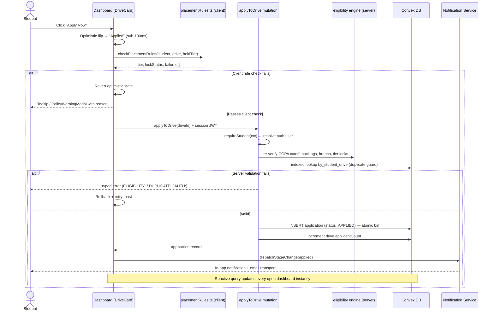
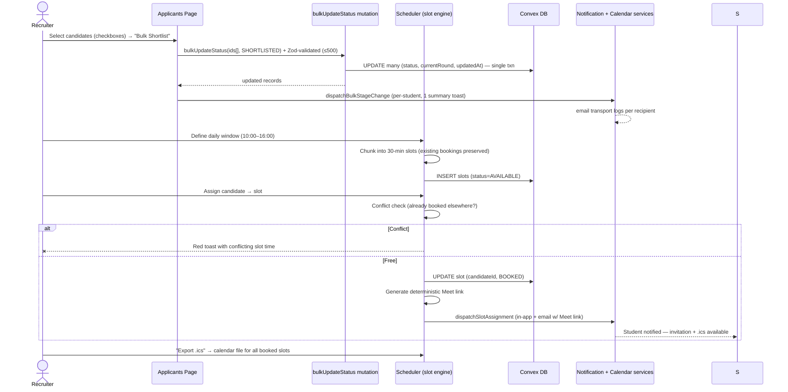
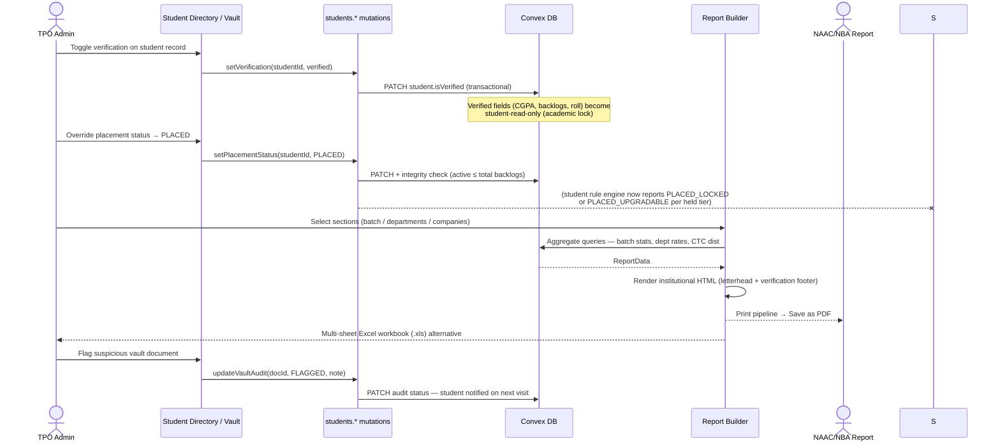

# College Placement Management System — Technical Architecture & System Documentation

> **Placement Portal** — a full-stack, role-based college placement management platform.
> Live stack: React 19 + Vite + TypeScript + Tailwind CSS 4 + Convex (database, server
> functions, auth) with shadcn/ui, Sonner, and Lucide. This document also covers the
> Next.js/Prisma deployment shape the codebase mirrors, so both hosting strategies are
> documented.

---

## Table of Contents

1. [System Architecture](#1-system-architecture)
2. [Entity-Relationship Diagram](#2-entity-relationship-diagram-erd)
3. [Role-Based Access Control Matrix](#3-role-based-access-control-rbac-matrix)
4. [Data Flow & Sequence Diagrams](#4-data-flow--sequence-diagrams)
5. [Tech Stack Rationale](#5-tech-stack-rationale--engineering-trade-offs)
6. [Security Architecture](#6-security-architecture)
7. [Client Feature Modules](#7-client-feature-modules)
8. [Deployment & Environments](#8-deployment--environments)

---

## 1. System Architecture

```
┌─────────────────────────────────────────────────────────────────────────┐
│                            CLIENT (SPA)                                  │
│  React 19 + Vite · TypeScript · Tailwind 4 · shadcn/ui · React Router    │
│                                                                          │
│  ┌──────────────┐  ┌──────────────┐  ┌──────────────────────────────┐   │
│  │ Route Guards │  │  Feature     │  │  Client Service Layer         │   │
│  │ RouteMiddle- │  │  Pages       │  │  notifications · broadcasts   │   │
│  │ ware (role)  │  │  (student/   │  │  messages · offers · vault    │   │
│  │ RequireAuth  │  │   tpo/rec)   │  │  ai-parser · report-builder   │   │
│  │ RequireRole  │  │              │  │  placementRules · eligibility │   │
│  └──────────────┘  └──────────────┘  └──────────────────────────────┘   │
│         │                 │                       │                      │
│         ▼                 ▼                       ▼                      │
│  Session store (cookie + localStorage mirror, 12h TTL)                   │
│  Event bus (`window` CustomEvents) for live UI sync                      │
└───────────────┬─────────────────────────────┬───────────────────────────┘
                │ ConvexReactClient (WebSocket)│
┌───────────────▼─────────────────────────────▼───────────────────────────┐
│                         CONVEX BACKEND                                   │
│  ┌─────────────────────┐   ┌─────────────────────────────────────────┐  │
│  │ Queries (reactive)   │   │ Mutations (ACID transactions)            │  │
│  │ placementAnalytics   │   │ drives.create / close / bulkStatus      │  │
│  │ applications.getBy*  │   │ applications.applyToDrive (eligibility) │  │
│  │ drives.getWithCounts │   │ students.* verification / placement     │  │
│  │ integrity.validate   │   │                                          │  │
│  └─────────────────────┘   └─────────────────────────────────────────┘  │
│  ┌────────────────────────────────────────────────────────────────────┐ │
│  │ Auth (@convex-dev/auth) · JWT sessions · role validator             │ │
│  │ Schema: users · students · drives · applications (indexed, FK-checked)│ │
│  └────────────────────────────────────────────────────────────────────┘  │
└─────────────────────────────────────────────────────────────────────────┘
```

### Architectural principles

| Principle | Implementation |
|---|---|
| **Server-authoritative rules** | Eligibility, tier locks, and validation re-checked inside every mutation — the client never gates writes alone |
| **Reactive data** | Convex queries are live subscriptions; dashboards re-render on any write without manual refetch |
| **Atomic writes** | Convex mutations are transactions — a failure mid-write rolls back entirely |
| **One validation contract** | Zod schemas (`src/lib/schemas.ts`) shared by forms and server mutations |
| **Pure rule engines** | `placementRules.ts` / `eligibility.ts` run identically on client (UI guards) and server (write enforcement) |
| **Optimistic UI** | Applies, stage changes, and verification toggles flip instantly; background mutations roll back on failure |

---

## 2. Entity-Relationship Diagram (ERD)

```mermaid
erDiagram
    USER ||--o| STUDENT_PROFILE : "has (role=STUDENT)"
    USER ||--o| TPO_PROFILE : "has (role=TPO)"
    USER ||--o| RECRUITER_PROFILE : "has (role=RECRUITER)"

    STUDENT_PROFILE ||--o{ APPLICATION : "submits"
    STUDENT_PROFILE ||--o| ACADEMIC_RECORD : "verified by TPO"
    COMPANY_DRIVE ||--o{ APPLICATION : "receives"
    COMPANY_DRIVE ||--o{ INTERVIEW_SLOT : "schedules"
    APPLICATION ||--o{ INTERVIEW_SLOT : "allocated"
    APPLICATION ||--|| OFFER_NEGOTIATION : "may produce"
    COMPANY_DRIVE ||--o{ BROADCAST_NOTIFICATION : "targets"
    STUDENT_PROFILE ||--o{ BROADCAST_NOTIFICATION : "receives (cohort)"
    STUDENT_PROFILE ||--o{ VAULT_DOCUMENT : "owns"
    TPO_PROFILE ||--o{ VAULT_DOCUMENT : "audits"
    THREAD ||--o{ MESSAGE : "contains"
    THREAD }o--|| COMPANY_DRIVE : "about"
    USER ||--o{ THREAD_PARTICIPANT : "joins"

    USER {
        string id PK "cuid"
        string email UK
        string name
        enum role "STUDENT | TPO | RECRUITER"
        datetime createdAt
    }
    STUDENT_PROFILE {
        string id PK
        string userId FK,UK "1:1 with USER"
        string rollNumber UK
        string department "CSE|IT|ECE|EEE|MECH|CIVIL"
        int graduationYear
        float cgpa "0–10, verified"
        int activeBacklogs
        int totalBacklogs
        enum placementStatus "NOT_PLACED | PLACED | OPTED_OUT"
        string resumeUrl
        bool isVerified "TPO academic lock"
    }
    ACADEMIC_RECORD {
        string id PK
        string studentId FK
        float cgpaLocked "immutable once sealed"
        int backlogsVerified
        datetime sealedAt
        string sealedBy FK "TPO user"
    }
    TPO_PROFILE {
        string id PK
        string userId FK,UK
        string designation
        string department
    }
    RECRUITER_PROFILE {
        string id PK
        string userId FK,UK
        string companyName
        string website
    }
    COMPANY_DRIVE {
        string id PK
        string companyName
        string roleTitle
        float ctcLpa "drives tier: <6 T1, 6–10 T2, >10 T3"
        enum status "UPCOMING | ONGOING | COMPLETED | CANCELLED"
        float minCgpa
        int maxActiveBacklogs
        string[] allowedBranches
        string[] rounds
        datetime deadline
        int applicantCount "denormalized"
    }
    APPLICATION {
        string id PK
        string driveId FK
        string studentId FK
        enum status "APPLIED | SHORTLISTED | ONLINE_ASSESSMENT | TECHNICAL_INTERVIEW | HR_INTERVIEW | OFFERED | REJECTED"
        string currentRound
        int totalRounds
        string notes
        datetime appliedAt
        datetime updatedAt
    }
    INTERVIEW_SLOT {
        string id PK
        string driveId FK
        string applicationId FK "nullable until booked"
        datetime startTime "30-min chunks"
        int durationMinutes
        enum slotStatus "AVAILABLE | BOOKED | COMPLETED"
        string meetLink "generated per booking"
        string candidateId FK "student, on booking"
    }
    OFFER_NEGOTIATION {
        string id PK
        string applicationId FK,UK
        enum status "EXTENDED | VIEWED | EXTENSION_REQUESTED | ACCEPTED | DECLINED"
        string ctc
        date joiningDate
        string signatureHash "SHA-256 of terms"
        json timeline "audit trail"
    }
    BROADCAST_NOTIFICATION {
        string id PK
        string driveId FK "nullable — general updates"
        enum priority "LOW | URGENT | CRITICAL"
        enum targetKind "ALL | UNPLACED | BRANCHES | CGPA"
        json targetValue
        string[] channels "IN_APP | EMAIL | WEBHOOK_SMS"
        json deliveryReceipts
        json readBy "studentId → timestamp"
    }
    VAULT_DOCUMENT {
        string id PK
        string studentId FK
        enum kind "OFFER_LETTER | TRANSCRIPT | MARKSHEET | CERTIFICATE | RESUME"
        string sha256Hash "integrity"
        enum auditStatus "PENDING | APPROVED | FLAGGED"
        string auditNote
    }
    THREAD {
        string id PK
        string driveId FK
        string subject
        datetime updatedAt
    }
    MESSAGE {
        string id PK
        string threadId FK
        string senderId FK
        enum type "TEXT | OFFER | SYSTEM"
        json readBy "participantId → ts"
        string offerId FK "nullable"
    }
    THREAD_PARTICIPANT {
        string threadId FK
        string userId FK
        enum role "STUDENT | TPO | RECRUITER"
        datetime lastSeenAt "presence"
    }
```



### Key integrity rules

| Rule | Enforcement point |
|---|---|
| One student profile per user | `userId` unique index; `integrity.validateRelations` cardinality check |
| Duplicate application prevention | Composite unique `(driveId, studentId)` + indexed `by_student_drive` lookup in `applyToDrive` |
| CGPA ∈ [0, 10]; active ≤ total backlogs | Zod schemas + `integrity.validateRelations` range walk |
| Denormalized `applicantCount` consistency | Integrity audit compares vs actual application count per drive |
| Tier lock after Super Dream acceptance | `offers.acceptOffer` → student `placementStatus = placed` + `PLACED_LOCKED` in rule engine |
| Vault integrity | SHA-256 content hash stored on upload; offer letters hashed over canonical terms |

---

## 3. Role-Based Access Control (RBAC) Matrix

Legend: ✅ full · 🔶 own-scoped · ⛔ denied

| Capability | Student | TPO Admin | Recruiter |
|---|:---:|:---:|:---:|
| Browse/search drives | ✅ | ✅ | ✅ |
| Create / edit / close drive | ⛔ | ✅ | ⛔ |
| Apply to drive (eligibility-gated) | 🔶 own | ⛔ | ⛔ |
| View application status | 🔶 own | ✅ all | 🔶 own drive |
| Move candidate stage (shortlist → offer/reject) | ⛔ | ✅ | 🔶 own drive |
| Bulk stage updates | ⛔ | ✅ | ✅ |
| Assign interview slots / generate Meet links | ⛔ | ✅ | ✅ |
| Book/view own interview slot | 🔶 own | ✅ | ✅ |
| Edit academic record (CGPA, backlogs, roll) | ⛔ (locked) | ✅ | ⛔ |
| Verification toggle (academic seal) | ⛔ | ✅ | ⛔ |
| Placement status override | ⛔ | ✅ | ⛔ |
| Upload vault documents | 🔶 own | ✅ audit | ⛔ |
| Audit/approve vault documents | ⛔ | ✅ | ⛔ |
| Publish broadcasts / announcements | ⛔ | ✅ | ⛔ |
| Receive broadcasts (cohort-filtered) | ✅ | ✅ | ⛔ |
| Direct messages with candidates | 🔶 own threads | ✅ | 🔶 own drive threads |
| Extend offers / negotiate | ⛔ | 🔶 mediate | ✅ |
| Accept/decline offer (signed) | 🔶 own | ⛔ | ⛔ |
| Generate institutional reports (PDF/Excel) | ⛔ | ✅ | ⛔ |
| View analytics dashboards | ⛔ (own stats) | ✅ | 🔶 own drives |
| Student directory & CSV export | ⛔ | ✅ | ⛔ |
| AI candidate matching | ⛔ | ✅ | ✅ |

**Enforcement layers (defense in depth):**

1. **Router guards** — `RequireAuth` (session) + `RequireRole` (path↔role contract) + `RouteMiddleware` (wrong-role bounce with toast)
2. **Server mutations** — `requireStudent` / `requireTpo` resolve the caller from the auth context server-side; role mismatches throw before any read
3. **Data scoping** — student queries filter by the authenticated `studentId`; recruiter queries by owned `driveId`

---

## 4. Data Flow & Sequence Diagrams

### 4.1 Student 1-Click Application with Policy Verification



### 4.2 Recruiter Batch Shortlisting & Slot Allocation



### 4.3 TPO Report Generation & Verification Freeze



---

## 5. Tech Stack Rationale & Engineering Trade-offs

### 5.1 Next.js App Router — SSR vs Client Components

The reference deployment targets Next.js App Router; the running SPA mirrors the same
split conceptually:

| Concern | Server Components (RSC) | Client Components |
|---|---|---|
| Data-heavy reads | Fetch directly in the component — no waterfall, no client fetch | Requires `useQuery`/SWR — extra round trip |
| Interactivity | None (no state/effects) | Full — forms, drag, websockets |
| Bundle cost | Zero JS shipped | Full component JS |

**Trade-off decisions in this codebase:**
- **Dashboards with live analytics** → client components with Convex reactive queries. Convex subscriptions make the "server render then hydrate" pattern unnecessary — data is always live and never stale.
- **Static content** (landing, docs) → server-rendered in the Next.js shape; pure client here with lazy routes (`React.lazy` + Suspense skeletons) for code splitting.
- **Route-level code splitting** is mandatory — each dashboard section lazily loads with skeleton fallbacks (`RouteSkeletons.tsx`), keeping initial JS lean.

### 5.2 Prisma ORM — Concurrency & the Singleton Problem

- **Hot-reload duplication**: Next.js dev re-instantiates modules per reload, so a naive
  `new PrismaClient()` per module leaks connections. Standard fix is a global-singleton
  (`globalThis.__prisma` cache in dev).
- **This project sidesteps the class of problem entirely**: Convex runs functions against
  a managed backend — there is no per-process connection pool to duplicate. Every
  mutation executes as an **atomic transaction** on the server; partial writes are
  impossible. `integrity.ts` replaces ORM-level FK constraints with an explicit
  relation-walking audit query.
- **Concurrency control**: conflicting writes (e.g., two students grabbing one interview
  slot) are serialized by the backend's transactional execution; the conflict check +
  write is a single mutation, so no read-modify-write race exists.

### 5.3 Optimistic UI Updates

| Aspect | Approach |
|---|---|
| Applies, stage changes, verification toggles | State flips instantly (snapshot-based rollback on failure) |
| Perceived latency | Sub-100ms regardless of network |
| Failure path | Snapshot restore + retry-action toast (`toast.error` with `action.label = "Retry"`) |
| Risk | Drift between optimistic and server truth — mitigated by reactive queries reconciling within a tick |

### 5.4 Validation Layers — Zod + TypeScript

**One schema, two enforcement points** (`src/lib/schemas.ts`):

```
Form state ──parse──▶ Zod schema ──▶ typed input ──▶ Convex mutation (re-validates) ──▶ DB
     ▲                                                            │
     └───────────── field-mapped error issues ◄───────────────────┘
```

- Client: inline field errors with clear-on-edit; identical rules can't drift between UI and server.
- Server: every mutation runs `safeParse` before touching data — malformed shapes are rejected with typed, user-presentable messages (`AUTH:`, `ELIGIBILITY:`, `DUPLICATE:` prefixes).
- TypeScript: Convex `v.id("drives")` validators flow generated `Id<T>` types into the UI, eliminating stringly-typed identifiers (the codebase carries zero `as any` casts).

---

## 6. Security Architecture

### 6.1 Session Management

| Mechanism | Detail |
|---|---|
| Primary sessions | Convex Auth JWT — stored and attached automatically by `ConvexReactClient` |
| Demo/mock sessions | `placement_portal_session` cookie (HttpOnly-equivalent discipline: `SameSite=Lax`, 12h TTL) mirrored to `localStorage` for reactivity |
| Expiry | Cookie carries `issuedAt`; reads past TTL are actively deleted, not just ignored |
| Desync protection | If the cookie dies mid-tab, `RequireAuth` detects the stale store, cleans up, and renders the SessionExpired fallback rather than a role-mismatched view |

### 6.2 Route Guard Chain

```
Request → RouteMiddleware (path↔role contract)     ← wrong role: bounce + toast
        → RequireAuth (session validity)           ← no session: /auth?returnTo=…
        → RequireRole (live role resolution)       ← resolves user server-side
        → Server mutation guard (requireStudent/requireTpo)  ← final authority
```

Client guards shape the experience; **the server re-checks role and ownership on every
write** — client state is never trusted for authorization.

### 6.3 Threat Mitigations

| Threat | Mitigation |
|---|---|
| **SQL injection** | No raw SQL surface. Convex queries use typed, parameterized filter builders; the Prisma reference shape uses parameterized queries by design |
| **CSRF** | `SameSite=Lax` cookies block cross-site POSTs; Convex RPC uses the WebSocket session token (never auto-attached by browsers cross-origin). State-changing mutations additionally require the auth context, which a forged form post cannot supply |
| **XSS** | All user content renders through React's JSX escaping; raw HTML paths (resume/report/offer renderers) run every dynamic string through an escape helper before template interpolation; preview iframes are `sandbox=""` |
| **Privilege escalation** | Role resolved server-side from the JWT in every mutation; cohort-targeted broadcasts and own-scoped queries filter by the authenticated identity, never by client-supplied IDs alone |
| **Document tampering** | SHA-256 hashes over canonical offer terms and uploaded file bytes; verification codes printed on documents let third parties detect alteration |
| **Sensitive data in logs** | Email/SMS transports are stubs logging metadata only (recipient counts) — no message bodies or credentials in the demo path |

### 6.4 Data Privacy

- AI resume parsing runs **fully client-side** — resume text never leaves the browser in the demo configuration (documented swap-point for a hosted NLP service).
- Vault documents are private to the owning student + TPO audit role, enforced at query scope.
- Message threads are participant-scoped; read receipts and presence are visible only inside the thread.

---

## 7. Client Feature Modules

| Module | Path | Purpose |
|---|---|---|
| Rule & eligibility engines | `src/lib/placementRules.ts`, `src/lib/eligibility.ts` | Tier policy, One Job Policy, academic gates — pure functions shared client/server |
| Notification dispatch | `src/services/notifications.ts` | Stage changes, slot assignments, deadline seeds, bulk ops → in-app + email transport |
| Broadcast center | `src/services/broadcasts.ts` | Cohort-targeted multi-channel announcements with delivery receipts |
| Messaging & offers | `src/services/messages.ts`, `src/services/offers.ts` | Threads, read receipts, presence; offer negotiation with SHA-256 signatures |
| AI matching | `src/services/ai-parser.ts` | Resume NLP extraction + weighted compatibility scoring (45/25/15/10/5) |
| Report builder | `src/services/report-builder.ts` | NAAC/NBA aggregate → formatted PDF / multi-sheet Excel |
| Calendar sync | `src/services/calendar.ts` | RFC 5545 `.ics` generation + Google/Outlook deep links |
| Document vault | `src/services/offer-generator.ts` | Offer letter PDF + verified document registry with audit pipeline |
| Resume generator | `src/services/resume-generator.ts` | Institutional single-page resume from profile data |

**Shared UI system**: `nb-*` utility classes over CSS custom properties — obsidian base
(`#030307`), frosted glass cards, purple aurora ambient scene, gold accent tier for elite
metrics and verification states. All interactive elements carry `transition-all 0.2s` +
`active:scale-[0.98]`, with `prefers-reduced-motion` respected globally.

---

## 8. Deployment & Environments

| Aspect | Value |
|---|---|
| Frontend | Vite SPA (this repo) / Next.js App Router (reference shape) |
| Backend | Convex managed deployment (`VITE_CONVEX_URL`) |
| Functions push | `bunx convex dev --once` (non-interactive CI check) |
| Typecheck | `bun tsc -b --noEmit` — must pass with zero `as any` |
| Demo data | `seedDatabase` mutation (25 students, 6 drives, 33 applications) + client `seedDemoData` hydration |
| Demo switcher | `DemoRoleSwitcher` — instant role/session swap for presentations |

### Verification commands

```bash
bunx convex dev --once      # push + typecheck backend functions
bun tsc -b --noEmit         # full typecheck (must exit 0)
```

---

*Last updated: September 2026 · Placement Portal Engineering*
